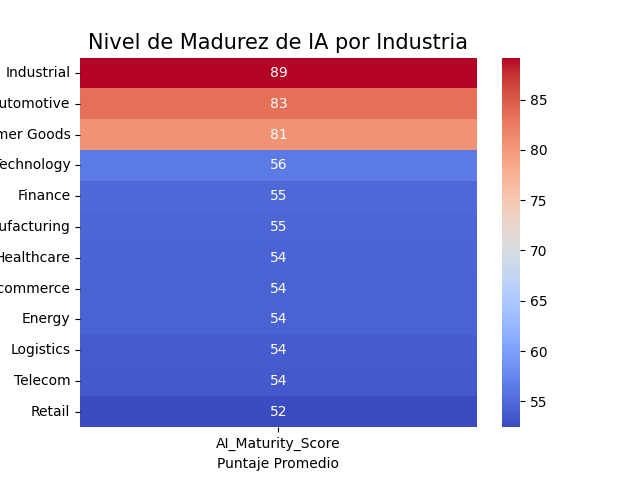
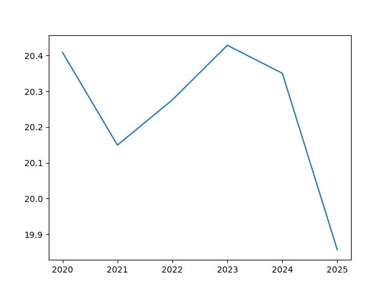

# Fortune500 AI Analysis Pipeline 🚀

Hola este es uno de mis primeros proyectos integrales de Data Science. El objetivo fue analizar cómo las empresas más grandes del mundo (Fortune 500) están usando la IA y si realmente les está dando ganancias (ROI), (DataSet sacado de kaggle).

Lo que más me costó, y mi mayor aprendizaje, fue traducir la lógica matemática al código. Pasar de los cálculos que en mi cabeza tenian mucho sentido a una estructura que funcione, manejar los montones de errores que salían al principio y adaptar toda esa lógica a la sintaxis de las libreias de Python fue el verdadero reto de este proyecto.

## ¿Qué hace mi proyecto?
El script hace todo el camino desde que los datos están sucios hasta generar reportes por consola y graficos:
* **Limpieza:** Comprobación y manejo de datos nulos NuN y valores duplicados, verificación de formatos, y el uso de IQR para comprobar outliers.
* **Cálculos y Métricas:**
    * **ROI Promedio:** Evaluación de rentabilidad por industria para identificar sectores líderes.
    * **Crecimiento de Madurez:** Cálculo de la tasa de adopción anual de IA por sector.
    * **Correlación Revenue/Inversión:** Análisis para validar si el gasto en tecnología impacta directamente en los ingresos.
    * **Segmentación de Rendimiento:** Filtrado de empresas de alto impacto (ROI > 30%) para detectar patrones de éxito.
    * *¿Por qué importa?* Estos cálculos permiten pasar de "simples datos" a una estrategia real, identificando qué industrias son más eficientes y dónde la inversión en IA tiene más sentido.
* **Reportes:** Creo un CSV con las empresas que mejor rendimiento tienen y gráficas automáticas.

## Estructura de archivos
* `main.py`: Orquesta las demas funciones.
* `DataCleaning.py`: Limpieza de datos.
* `Metricas.py` y `Analisis_Especifico.py`: Cálculos.
* `Visualizacion.py`: El código para crear las gráficas.
* `instrucciones.txt`: Lo que use para guiar el desarrollo del proyecto.

## 📊 Visualizaciones
Aquí puedes ver un poco de lo que genera el código:

### Madurez de IA por Sector

* Este mapa de calor muestra qué industrias se están tomando más en serio la IA.

### Tendencia del ROI

* Aquí se ve si la inversión realmente está subiendo o bajando con los años.

## Breve analisis de los datos 
Luego de todo, analisando a groso modo los datos, podemos ver un decenso en la rentabilidad y retorno de inversion, para saber el porque se necesita un analisis mas profundo, pero podria deberse a que las empresas estan apostando mucho de la rentabilidad al futuro de las IAs y eso afecta el retorno inmediato en los ultimos años.
Tambien me sorprendio ver a la industria automotris tan alto en el mapa de calor, yo suponia que sectores en mi cabeza más relacionados a la IA como finanzas o techonoliga tendrian un score más alto.

## ⚙️ Lo que aprendí 
* **Sobre los Outliers:** Al principio pensé en borrarlos todos con el IQR, pero me di cuenta de que muchos de esos datos aunque desproporcionados, me daban información valiosa que era un desperdicion borrar, como las grandes empresas que mueven la balanza de ingresos. Así que decidí dejarlos si tenían sentido.
* **La guerra contra los errores:** Manejar tantos errores seguidos me enseñó a leer mejor los mensajes de la terminal y a no entrar en pánico, e intentar no frustrame tanto cuando el codigo despues de mil intentos seguia dando un error.
* **Código segmentado:** Al principio hacía todo en una sola función, pero entendi que no era lo mejor cuando yo mismo me confundi leyendo el codigo.

---
**Autor:** Luciano Yanes  
**Tecnologías:** Python, Pandas, Matplotlib, Seaborn.
